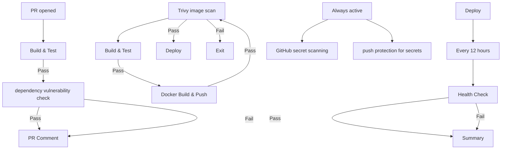

# simple-node-js-react-npm-app

This repository is for the
[Build a Node.js and React app with npm](https://jenkins.io/doc/tutorials/build-a-node-js-and-react-app-with-npm/)
tutorial in the [Jenkins User Documentation](https://jenkins.io/doc/).

## Full-Stack Architecture

The repository contains a full-stack Node.js and React application:
- **Frontend**: A Vite-powered React application with a "Learn React" link.
- **Backend**: An Express.js server that runs the application and serves API endpoints.

### API Endpoints

- `/api/hello`: A beautifully styled HTML API endpoint with a modern glassmorphic UI, smooth CSS gradient background, and a pulsing status badge. It demonstrates serving dynamic HTML straight from the backend.
- `/*`: A catch-all route to serve the built React frontend (`index.html`) to support client-side Single Page Application (SPA) routing.

## Getting Started

1. **Install Dependencies**: `npm install`
2. **Start Dev Server**: `npm run dev` (starts Vite out-of-the-box frontend proxying)
3. **Start Production Server**: `npm start` (Runs the full Express `server.js` stack on port 3000)

## Badges

## Pipeline Architecture Diagram

## Next Steps

* Add security (DevSecOps)
    1. Add `aquasecurity/trivy-action` after the Docker build step to scan image for vulnerabilities
    2. Fail the pipeline if any **CRITICAL** severity CVE is found
    3. Upload the scan report as an artifact

* Add Slack notifications
    1. Add `slackapi/slack-github-action` after the Docker build step to send a notification to a Slack channel
    2. Send a success message with the image URL and tags
    3. Send a failure message with the error details